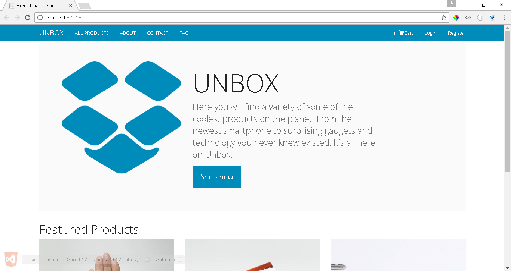
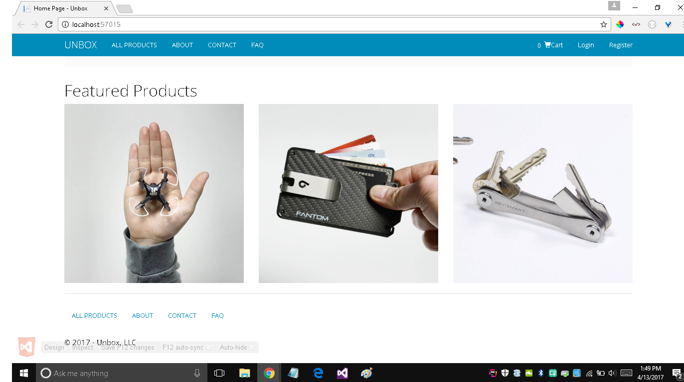
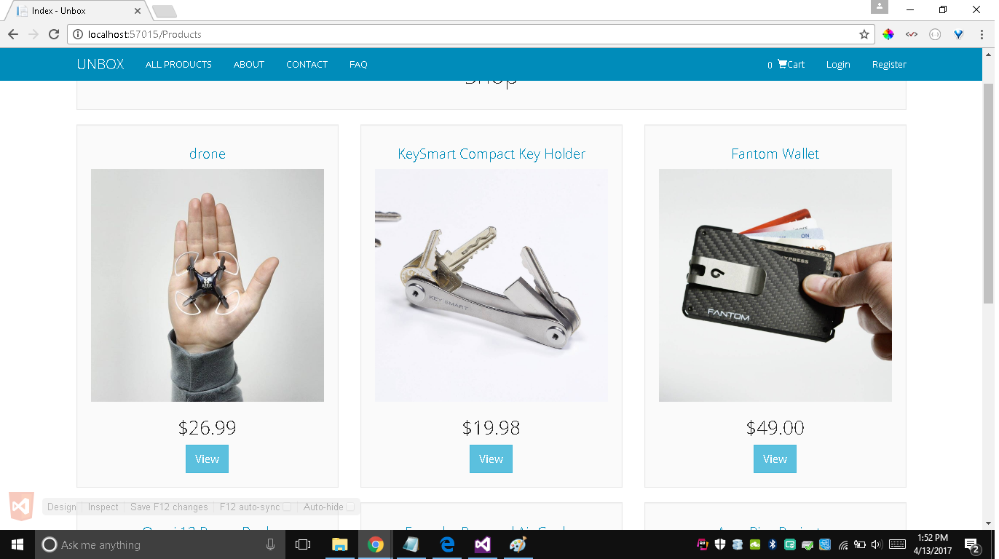
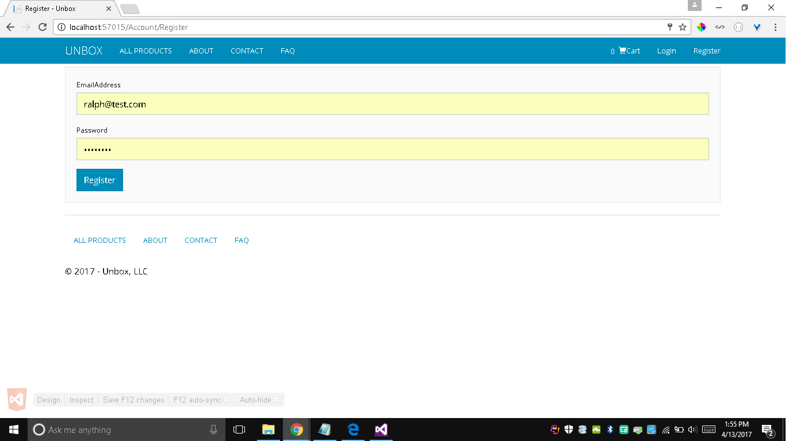
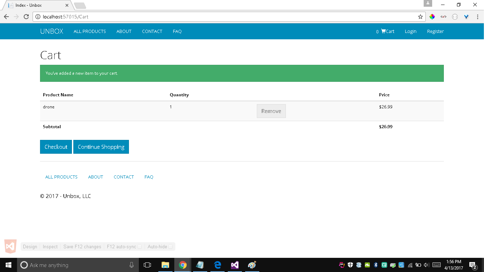
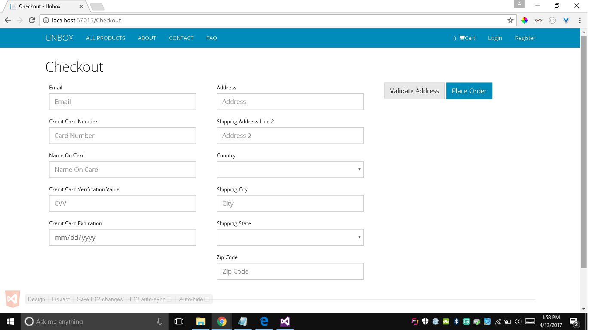

<h1>E-commerce Application</h1>

I built an e-commerce application using C# and asp.net

<h1>Features</h1>
<ul>
  <li>Customers can login and logout.</li>
  <li>Email account confirmation using Sendgrid API</li>
  <li>Address validation using Smarty Streets API</li>
  <li>Credit card payments using Braintree API</li>
  <li>Created a database for customer, products and orders using SQL</li>
</ul>

